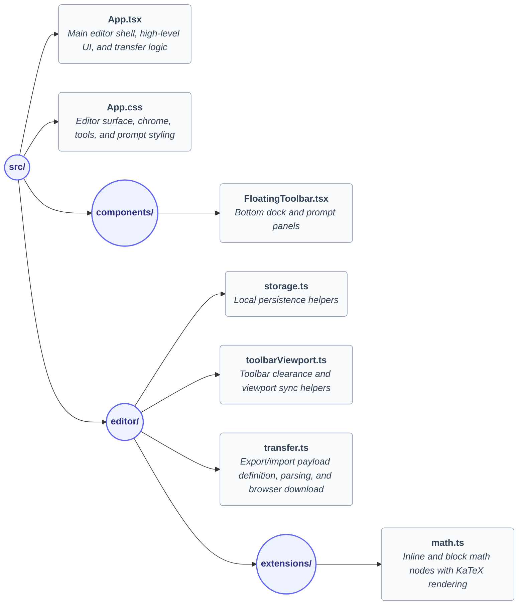

  

# 📝 MarkStudio

MarkStudio is evolving into a single-screen live writing editor. The current app is already editor-first: the writing surface is the product, formatting happens in place, and the UI stays minimal around the document. ✨

## 🚀 Current Product State

- **Single-screen editor** built with React 19, TypeScript 6, Vite 8, and Tiptap 3;
- **Local-first** document persistence in `localStorage`;
- **Floating bottom toolbar** for structure and insert actions;
- **Sticky top chrome** with theme toggle plus import/export controls;
- **Custom math nodes** rendered with KaTeX.

This repository is still early-stage. The codebase is intentionally small and explicit so future editor work can move quickly without carrying template-era abstractions.

## ✨ Implemented Features

### ✍️ Editing

- Paragraph writing with live formatting;
- Headings `H1` to `H3`;
- Bullet and ordered lists;
- Links with inline prompt support;
- Images by public URL;
- Inline math and block math nodes;
- Shortcut help panel and bottom dock controls.

### 💾 Document Continuity

- **Auto-save** of the current document to `localStorage`;
- **Theme preference** persistence to `localStorage`;
- **Export** of the current document as a versioned `.json` file.

## 🗂️ Data Model

MarkStudio currently uses Tiptap `JSONContent` as the canonical document model.

- **In-memory editor state**: Tiptap editor instance;
- **Local persistence**: `markstudio.editor-content` in `localStorage`;
- **Theme persistence**: `markstudio.editor-theme` in `localStorage`;
- **External file exchange**: versioned JSON payload (`ExportedDocumentV1`) for lossless reconstruction.

The current editor supports custom nodes like `inlineMath` and `blockMath`, so JSON is the format that preserves the document exactly.

The external file contract is documented in [docs/document-format.md](docs/document-format.md).

## 📥 Import and Export

MarkStudio supports exporting the current document as a versioned JSON file and importing it back to restore the session.

- For the external file contract, payload format, and limitations, see [docs/document-format.md](docs/document-format.md).
- For the UI behavior, validation flow, and state rehydration details, see [docs/code-overview.md](docs/code-overview.md).

## ⌨️ Keyboard Shortcuts

- `Ctrl/Cmd + B`: Bold
- `Ctrl/Cmd + I`: Italic
- `Ctrl/Cmd + H`: Open link prompt
- `Ctrl/Cmd + Shift + K`: Fallback link shortcut
- `Ctrl/Cmd + M`: Open math prompt
- `Ctrl/Cmd + Shift + I`: Open image prompt
- `Ctrl/Cmd + Alt + 1/2/3`: Toggle heading levels
- `Ctrl/Cmd + Shift + 7`: Ordered list
- `Ctrl/Cmd + Shift + 8`: Bullet list
- `Ctrl/Cmd + /`: Open shortcut help

## 📁 Project Structure



## 🛠️ Development

Install dependencies:
```bash
npm install
```

Start the app:
```bash
npm run dev
```

Quality checks:
```bash
npm run test
npm run lint
npm run build
```

📖 Documentation for the export/import contract lives in [docs/document-format.md](docs/document-format.md).
🗺️ An implementation-oriented map of the codebase lives in [docs/code-overview.md](docs/code-overview.md).
